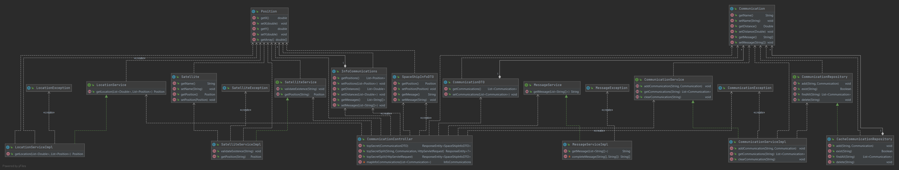

# Operación Fuego de Quasar

_El servicio de inteligencia rebelde ha detectado un llamado de auxilio de una nave portacarga imperial a la deriva en
un campo de asteroides. El manifiesto de la nave es ultra clasificado, pero se rumorea que transporta raciones y
armamento para una legión entera._

Se crea una api restful capaz de poder retornar la fuente y contenido del mensaje de auxilio, a partir de 3 satelites
para triangular la posicion y logica para poder descifrar el mensaje de auxilio a partir de mensajes incompletos debido
a un campo de asteroides frente a la nave.

## Comenzando 🚀

_Estas instrucciones te permitirán obtener una copia del proyecto en funcionamiento en tu máquina local para propósitos
de desarrollo y pruebas._

```
git clone https://github.com/FacundoCastellano/quasar.git
```

El mismo se encuentra actualmente hosteado en Google App Engine:

```
https://20210404t053215-dot-challenge-meli-309703.uc.r.appspot.com
```

Mira **Deployment** para conocer como desplegar el proyecto.

### Pre-requisitos 📋

_Para poder correr se necesitan las siguientes herramientas_

* Java 11
* Redis
* Google Cloud SDK Shell (para deploy)

```
Redis for Ubuntu  https://redislabs.com/ebook/appendix-a/a-1-installation-on-debian-or-ubuntu-linux/
Redis for Windows https://redislabs.com/ebook/appendix-a/a-3-installing-on-windows/a-3-2-installing-redis-on-window/
Redis for OS X	  https://redislabs.com/ebook/appendix-a/a-2-installing-on-os-x/
```

```
Google Cloud SDK Shell https://cloud.google.com/sdk/docs/quickstart
```

### Instalación 🔧

_Para instalar el proyecto se necesita correr comandos maven y levantar redis localmente (el proyecto se encuentra
configurado para el puerto por default -6379-)_

_Y aplicar comandos mvn sobre el proyecto_

```
mvn clean install
```

```
mvn spring-boot:run -Dspring-boot.run.profiles=dev
```

```
Redis for Ubuntu:	~/redis-2.6.9:$ redis-server redis.conf
Redis for Windows:      redis-server.exe
Redis for OS X:		~:$ redis-server
```

Las invocaciones necesarias para realizar las pruebas se encuentran en

```
http://localhost:8080/swagger-ui/#/
```

```
https://challenge-meli-309703.uc.r.appspot.com/swagger-ui/#/
```

## Deploy 📦

_Para realizar un correcto deploy se necesita un proyecto creado en Google Cloud Platform, una instancia de MemoryStore
Redis y un conector para el acceso a VPC sin servidores_

Para Redis, se puede crear la instancia a traves del siguiente comando con la terminal de Google Cloud SDK Shell parada
sobre el proyecto quasar

```
gcloud redis instances create communication-cache  --region=us-central1 --size=1 --redis-version=redis_5_0
```

Una vez creada, necesitamos modificar el valor de *spring.redis.host* en el *application.yml* de nuestro proyecto con el
host de la instancia generada. Para conocer el dato, lo vemos con el siguiente comando:

```
gcloud redis instances describe communication-cache --region us-central1
```

El conector para el acceso a VPC sin servidores es necesario ya que la instancia de redis se crea con una IP que no es
posible acceder directamente. Con el conector, crearemos un puente de comunicacion entre nuestra app y Redis. Es
importante remarcar que el parametro --region tiene que ser el mismo que la instancia redis creada anteriormente

```
gcloud compute networks vpc-access connectors create redis-vpc --network default --region us-central1 --range 10.8.0.0/28
```

Una vez realizado, es necesario modificar el atributo vpc_access_connector.name del app.yaml con el nombre del proyecto
de GCP

Por ultimo, corremos mvn y realizamos el deploy

```
mvn clean install
```

```
gcloud app deploy --appyaml=src/main/appengine/app.yaml
```

## Construido con 🛠️

_Las siguientes herramientas fueron utilizadas para el proyecto_

* [SpringBoot](https://spring.io/projects/spring-boot/) - El framework usado
* [Maven](https://maven.apache.org/) - Manejador de dependencias
* [Redis](https://redis.io/) - DB en memoria
* [Swagger](https://swagger.io/) - Documentacion de endpoints
* [Junit](https://junit.org/junit5/) - Tests unitarios
* [lemmingapex/trilateration](https://github.com/lemmingapex/trilateration) - FW para resolver operaciones de

## UML

_UML con las relaciones entre clases_



---
Template for [Villanuevand](https://github.com/Villanuevand)